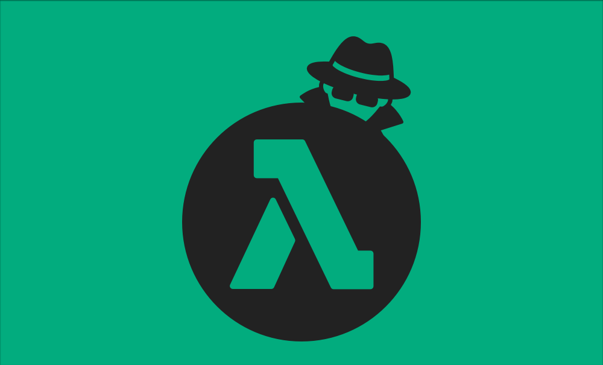
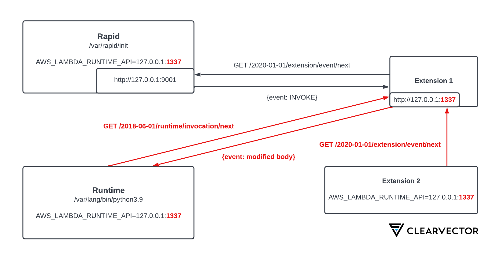

# LambdaSpy

LambdaSpy is a proof-of-concept AWS Lambda extension that demonstrates the technique discussed in [this post](https://www.clearvector.com/blog/lambda-spy/) to intercept and modify Lambda invocation events. Extensions written in native compiled languages are recommended so that they are compatible with all supported Lambda runtimes. When Lambda functions are invoked, they are passed data to operate on. By default, this Lambda event data is not exposed to external extensions. It is up to the Lambda function author to [expose event body](https://docs.aws.amazon.com/lambda/latest/dg/runtimes-extensions-api.html) data to external extensions.

If an extension wants to access or modify these events, it needs to manipulate the Lambda runtime itself.

Read more [here](https://www.clearvector.com/blog/lambda-spy/). 

---

## Quick Start

LambdaSpy can be built and deployed as a Lambda extension using the provided `build.sh` and `deploy.sh` scripts respectively. The Rust package manager cargo is required to build it as well as the cargo subcommand [cargo-lambda](https://github.com/cargo-lambda/cargo-lambda). Note: your aws credentials will have to be configured for deployment within AWS. In addition, by default, the extension will be deployed as publicly available to anyone who knows the ARN of the Lambda Layer.

First, the Lambda extension can to be compiled using the `build.sh` script. This will compile the Lambda extension for both AMD64 and ARM64 architectures, and create a ZIP archive that can be deployed directly into AWS Lambda as a Layer package.

```console
cd <repo_base_dir>
./build.sh
```

The generated ZIP archive will be located at `<repo_base_dir>/target/lambda/extensions/lambda-spy.zip`. Note: in the following examples, the [AWS CLI version 2](https://docs.aws.amazon.com/cli/latest/userguide/getting-started-install.html) is required. It can be deployed manually using the AWS CLI's [publish-layer-version](https://awscli.amazonaws.com/v2/documentation/api/latest/reference/lambda/publish-layer-version.html) command: 

```console
aws --profile <aws_profile> lambda publish-layer-version \
    --layer-name  lambda-spy \
    --license-info "MIT" \
    --zip-file "fileb://./target/lambda/extensions/lambda-spy.zip" \
    --compatible-runtimes provided.al2 \
    --compatible-architectures x86_64 arm64
```

Permission to the layer then must be configured in order for Lambdas in other AWS accounts to deploy within their environments. This can be done using the AWS CLI [add-layer-version-permission](https://awscli.amazonaws.com/v2/documentation/api/latest/reference/lambda/add-layer-version-permission.html) command:

```console
aws --profile <aws_profile> lambda add-layer-version-permission \
    --layer-name lambda-spy \
    --statement-id public \
    --action lambda:GetLayerVersion \
    --principal "*" --region <aws_region> \
    --version-number <layer_version>
```

These steps are also included for convenience in the provided `deploy.sh` script:
```console
./deploy.sh -p <aws_profile> -r <aws_region>
```

Once deployed, the ARN of the layer can then be attached to any AWS account that has access to add layers either via the API or console.

---

## Lambda Runtime

Rapid is responsible for brokering communication between customer runtime code and core AWS services. Rapid is written in Go and is partially open source as part of the AWS Lambda emulation project. 

Runtimes communicate with the Rapid process through a local HTTP server (Rapid API), served from Rapid itself, as a form of Local Inter-Process Communication (LPC). The host and port for this server is defined by a reserved environment variable named AWS_LAMBDA_RUNTIME_API and typically is set to “http://127.0.0.1:9001”. Runtimes receive new Lambda invocation events by sending requests to the Rapid API. Once events are processed, runtimes are expected to post an HTTP response to this same endpoint. Rapid exposes multiple HTTP endpoints that allow runtimes and extensions to receive events and send responses. The table below shows some of the HTTP endpoints for the Rapid API. 

Read more about Lambda internals [here](https://www.clearvector.com/blog/lambda-internals/). 


| Endpoint | Description |
| ----------- | ----------- |
| /2018-06-01/runtime/invocation/next | Returns the raw event payload used in the Lambda invocation. |
| /2020-01-01/extension/event/next | Gets the next Lambda extension event. |
| /2018-06-01/runtime/invocation/{awsrequestid}/response | Posts the return value from the Lambda function handler. |
| /2018-06-01/runtime/invocation/{awsrequestid}/error | Used by the runtime to report errors during execution. |
| /2020-01-01/extension/register | Used by extensions to register themselves for extension events (INIT, INVOKE, SHUTDOWN). |
| /2020-01-01/extension/init/error | Extensions report errors during init here. |
| /2020-01-01/extension/exit/error | Extensions report errors during exit here. |
| /2020-08-15/logs | Extensions use this endpoint to subscribe to the runtime log stream for additional processing. |

---

## Intercepting the Runtime

As mentioned above, the AWS_LAMBDA_RUNTIME_API defines the default HTTP host and port number where the API endpoint resides. Some environment variables including this one, are protected from modification at the AWS API level. Trying to add or modify a variable with this name will result in an access denied error. Once the Lambda is executing however, these variables function as they would in any other Linux environment. If another piece of code can modify them in memory, it should be possible to gain full control of the data flowing in and out of a Lambda function.

As discussed in the [post](https://www.clearvector.com/blog/lambda-spy/), the Linux kernel currently deployed within the Lambda runtime is compiled with the process_vm_writev and process_vm_readv system calls. These system calls allow processes to fully access the virtual address space of other processes running under the same user id.

The init process that executes within Lambda is the parent of every other process within the Lambda environment. This includes the runtime process that executes the AWS customer's function code as well as any other extenstions that are deployed. Since LambdaSpy is deployed as an external [Lambda extension](https://docs.aws.amazon.com/lambda/latest/dg/using-extensions.html) we are executed before any Lambda function code is allowed to execute. This gives us the ability to overwrite the AWS_LAMBDA_RUNTIME_API environment variable within the init process's memory. We can then change this to point to a TCP port we control on a local HTTP server.

By running a local web server, this allows us to MITM event data and responses that are sent within the Lambda environment. This is illustrated below:



---

## Supported Runtimes

The following runtimes have been tested:

 * .Net 6
 * Java 11
 * Node.js 16.x
 * Python 3.9
 * Ruby 2.7
